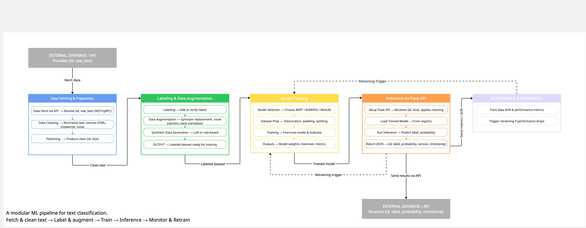

# Text Classification Project

## Overview
This project implements a text classification pipeline that predicts the category of scientific articles using their title, abstract, and categories.

## Architecture

## Problem Type
Although defined as multi-label, the dataset behaves as a multi-class classification problem with 4 classes.

## Pipeline
- Data Merging
- Text Construction
- TF-IDF Feature Extraction
- Logistic Regression Model
- Evaluation (Accuracy, F1-score)

## Model
- TF-IDF Vectorizer
- Logistic Regression

## How to Run

pip install -r requirements.txt
python src/main.py

## Output
- predictions.csv (stored in outputs/)

## Improvements (Future Work)
- Use BERT / SciBERT
- Hyperparameter tuning
- Feature engineering
